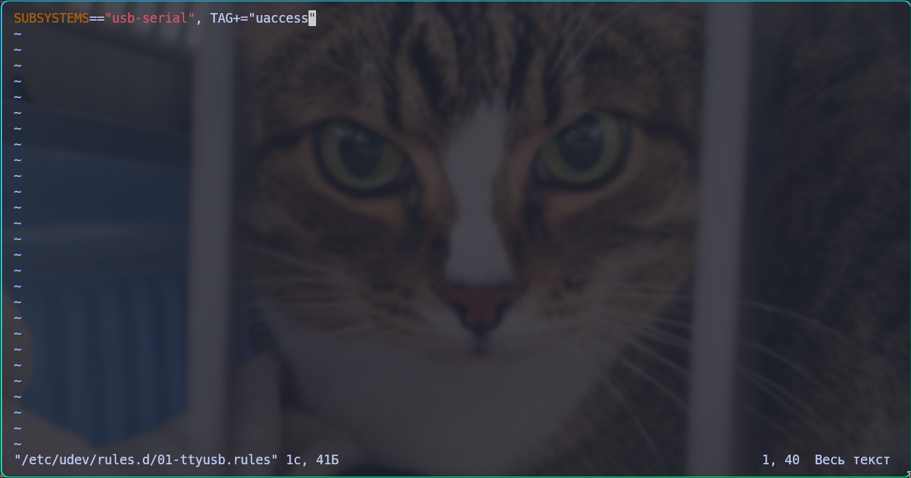

# Как настроить порты для Arduino на Arch Linux
По умолчанию Arch предоставляет доступ к последовательным портам только для пользователя **root** 

Нам необходимо выдать доступ к портам для основного юзера что бы прошивать платы через IDE

## Как выдать этот доступ?
Информация с вики Arch`а: [ссылка](https://wiki.archlinux.org/title/Arduino#Accessing_serial, "вот")

1. Открываем терминал и прописываем: 
```bash
sudo vim /etc/udev/rules.d/01-ttyusb.rules
```
Создается файл __01-ttyusb.rules__
в директории __/etc/udev/rules.d/__

2. В данном файле необходимо прописать:
```rules
SUBSYSTEMS=="usb-serial", TAG+="uaccess"
```
Изначально vim находится в __режиме прсмотра__ файла, нам необходимо перейти в __режим вставки__ нажав клавишу __I__

Должно выглядеть как то так:


3. После того как прописали строчку жмём клавишу __ESC__ и пишем __:wq__
Данная "команда" сохранит файл и выйдет из vim`а

4. После всего этого пишем в терминал
 ```bash
reboot #команда для перезагрузки
```

После этого доступ к последовательным портам открыт для обычных юзеров
